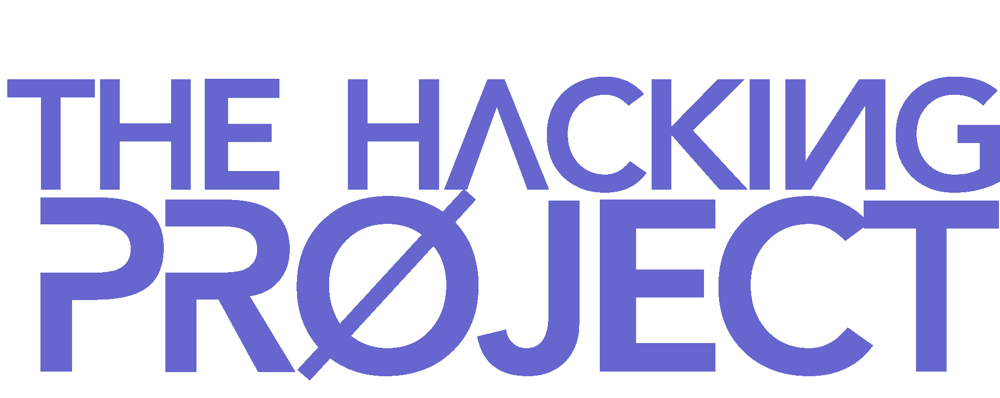

---

  
  &nbsp;&nbsp;&nbsp;
  
  &nbsp;&nbsp;&nbsp;
  

---

## Introduction Training

This is my repository for all my projects during the coding bootcamp at [The Hacking Project](https://www.thehackingproject.org/):
3 intense weeks in bootcamp to learn how to create a simple website, automate recurring tasks and understand the challenges of code.

## :chart_with_upwards_trend: Training program

### [:heavy_check_mark: **Week 1:** Introduction Week](https://github.com/BenjaminCharmes/THP_Introduction/tree/main/Week_1)

- [**Day 1:** Start learning HTML, CSS and create the first page: MotherFuckingWebsite with 3 different versions](https://github.com/BenjaminCharmes/THP_Introduction/tree/main/Week_1/Day_1)
- [**Day 2:** Validating project: Reproduce google page](https://github.com/BenjaminCharmes/THP_Introduction/tree/main/Week_1/Day_2)
- [**Day 3:** Start learning git, github and deploy online google page of day 2 with Github pages](https://github.com/BenjaminCharmes/THP_Introduction/tree/main/Week_1/Day_3)
- [**Day 4:** Start learning bootstrap and create our page startup](https://github.com/BenjaminCharmes/THP_Introduction/tree/main/Week_1/Day_4)
- [*Day 5:* Create a landing page](https://github.com/BenjaminCharmes/THP_Introduction/tree/main/Week_1/Day_5)

### :heavy_check_mark: Week 2: Programming with Ruby

- Day 1: Team work on GitHub & installation all tools for Ruby & Ruby on Rails
- Day 2: Validating project: the exercices in Ruby
- Day 3: Correction project & discover OOP in Ruby
- Day 4: Validating project: Ruby basics
- Day 5: Correction project & Kata challenges day

### :heavy_check_mark: Week 3: Programming with Ruby

- Day 1: Validating project: Testing with RSPEC in Ruby
- Day 2: Testing and exercices Ruby
- Day 3: Create a first bot twitter
- Day 4: Validating project: Art of scrapping
- Day 5: Automatisation, serialization in Ruby

## 🚨 - Disclaimer

The majority of these projects are those of a beginner, and are therefore not perfect or optimal. The training is intense, so it is difficult to come back later to a past project to improve it.

All advice is welcome 😊

## 📫 - Contact me

If you wish to contribute to the improvement of this repository or if you simply have questions, you can contact me on these networks:

&nbsp;&nbsp;&nbsp;

&nbsp;&nbsp;&nbsp;

